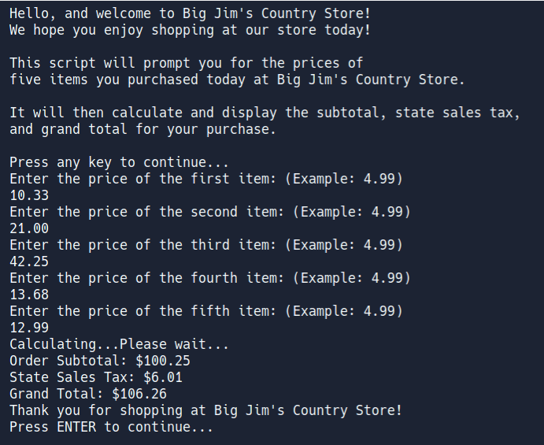

# Python Evidence: Big Jim's Country Store

## Summary

In this project, write user-defined (custom) functions that:

 - welcome the user to the store
 - briefly explain to the user what the script will do
 - prompt user to enter the prices of five store items
 - calculate the state sales tax on the purchase
  > (assume a state sales tax rate of **6.00%**)
 - calculate the grand total for the purchase
 - neatly display the final output 
  
  Include a sentence in each function that summarizes in plain English what the function does (This is known as a _docstring_ or documentation string).

  Enclose your docstring in a pair of triple quotation marks.
&nbsp; 
 
&nbsp; 
## Project Hints

 - How could you use a loop in a function to get the five prices from the user?
 - Instead of multiple variables, what other Python data container that we've talked about could you use to store the five prices?
 - Use short, descriptive names for your:
    -  variables
    -  arguments
    -  parameters
    -  functions 
&nbsp; 
 
&nbsp; 

## All done?
> Save your work to your H: drive as: _country_store.py_

---
&nbsp; 
 
&nbsp; 
## Sample Output

