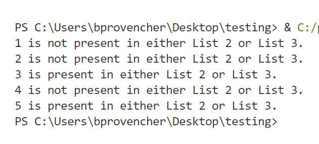

# Lesson Plan: Using If Statements with Python Lists

## Overview
In this lesson, students will learn how to use **if statements** to manipulate Python lists. We'll cover checking for specific elements, ensuring a list is not empty, and comparing the contents of two lists. The lesson aligns with the **Michigan K-12 Computer Science Standards**.

## Key Terms & Concepts
- **If statement**: A conditional statement that allows us to execute different code blocks based on whether a condition is true or false.
- **Python list**: An ordered collection of items, enclosed in square brackets (`[]`).

## Lesson Outline

### 1. Lesson Hook (1 - 2 minutes)
- **Activity**: Show students a list of fruits (e.g., `fruits = ["apple", "banana", "cherry"]`) and ask them to identify if a specific fruit is in the list.
- **Discussion**: Why might we need to check if an element exists in a list?

### 2. Mini Lesson (8 - 10 minutes)
- **Topic**: Using `if` statements with Python lists.
- **Content**:
    - Checking for a specific element using `in` keyword.
    - Ensuring a list is not empty using `if` and `len()`.
    - Comparing two lists using loops and `if` statements.

### 3. Guided Practice (15 minutes)
- **Activity 1**: Write a function that checks if a given element exists in a list.
```python
def element_exists(lst, target):
    return target in lst

# Example usage:
my_list = [1, 6, 3, 5, 3, 4]
target_element = 3
print(element_exists(my_list, target_element))  # Output: True
```
```python
def element_exists_count(lst, target):
    return lst.count(target) > 0

# Example usage:
print(element_exists_count(my_list, target_element))  # Output: True
```
```python
def element_exists_count(lst, target):
    return lst.count(target) > 0

# Example usage:
print(element_exists_count(my_list, target_element))  # Output: True
```
- **Activity 2**: Create a list of students' names. Use an `if` statement to print a message if the list is empty.
```python
# Create a list of students' names
students = ["Alice", "Bob", "Charlie"]

# Check if the list is empty using len()
if len(students) == 0:
    print("The list of students is empty.")
else:
    print("The list of students contains names.")

# Output:
# The list of students contains names.
```
- **Activity 3**: Compare three lists (e.g., `list1`, `list2` and `list3`) and print the common elements.
```python
def check_common_elements(list1, list2, list3):
    for element in list1:
        if element in list2 or element in list3:
            print(f"{element} is present in either List 2 or List 3.")
        else:
            print(f"{element} is not present in either List 2 or List 3.")

# Example usage:
list1 = [1, 2, 3, 4, 5]
list2 = [3, 5, 7, 9]
list3 = [6, 8, 10]
check_common_elements(list1, list2, list3)
```

```python
# Using sets to check for membership rather than Python lists
def check_student_enrollment(student, biology_1, biology_2, biology_3):
    return student in biology_1 and (student in biology_2 or student in biology_3)

# Example usage:
biology_1 = {"Alice", "Bob", "Charlie"}  # Use sets instead of lists
biology_2 = {"Bob", "David", "Eve"}
biology_3 = {"Alice", "Eve", "Frank"}

specific_student = "Alice"
result = check_student_enrollment(specific_student, biology_1, biology_2, biology_3)

if result:
    print(f"{specific_student} is enrolled in Biology 1 and at least one of Biology 2 or Biology 3.")
else:
    print(f"{specific_student} is not enrolled in both Biology 1 and either Biology 2 or Biology 3.")


### 4. Station Rotation (20 minutes)
- **Station 1**: Write a program that prompts the user for a fruit name and checks if it's in the `fruits` list.
- **Station 2**: Given a list of numbers, write a function to find the maximum value.
- **Station 3**: Create a list of programming languages. Use a loop to print each language's name.
```python
# Station 1
# Check if a Fruit Exists in a List
fruits = ["apple", "banana", "orange", "grape", "kiwi"]

user_input = input("Enter a fruit name: ").lower()  # Convert input to lowercase
if user_input in fruits:
    print(f"{user_input} is in the list of fruits.")
else:
    print(f"{user_input} is not in the list of fruits.")

# Station 2: Find the Maximum Value in a List
def find_max_value(numbers):
    if len(numbers) == 0:
        print('Sorry, but your list is empty!')
    else:
        return max(numbers) # Will return None if list is empty

# Example usage:
my_numbers = []
max_value = find_max_value(my_numbers)
print(f"The maximum value is: {max_value}")


# Station 3: Loop Through List and Print Programming Languages
programming_languages = ["Python", "Java", "C++", "JavaScript", "Ruby"]

print("List of programming languages:")
for lang in programming_languages:
    print(lang)


```
### 5. Activities (10 minutes)
- **Activity 1**: Students work in pairs to create their own lists and write `if` statements to perform specific checks.
- **Activity 2**: Pair Programming: One student writes the code, and the other reviews and suggests improvements.
    - Example: Student A writes an `if` statement to check if a specific element exists in their list, while Student B provides feedback.
    - Switch roles after completing the task.
- **Activity 3**: Discuss the results as a class.

### 6. Independent Practice (5 minutes)
- **Task**: Students individually write a program that compares two lists and prints the unique elements.

### 7. Assessment
- **Task**: Provide students with a list and ask them to write an `if` statement to check if a specific element is present.

### 8. Differentiation
- **Advanced Students**: Challenge them to write more complex conditions in their `if` statements.
- **Struggling Students**: Provide additional examples and scaffolded code.

### 9. Discussion Questions
1. *Why is it important to check if an element exists in a list before performing an action?*
    - **Answer**: Avoids errors and ensures efficient code execution.
2. *How can we use `if` statements to compare two lists?*
    - **Answer**: Iterate through one list and check if each element exists in the other list.

