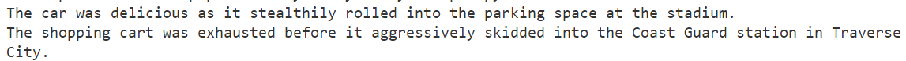

# Variables: Writing a Silly Story

## Objective

> *Define and assign values to several Python variables*
>
> *Use the variables to write a silly story in Visual Studio Code*


## Sample Output



## General Specifications

- Add a comment block 
```python
# Abraham Lincoln
# 24 MAR 20XX
# Intro to Python Variables
```
- Use short, descriptive filenames
- Write your filenames in lowercase

## Resources & Examples

- [Python variables](https://www.programiz.com/python-programming/variables-constants-literals)
- [Python f-strings](https://www.w3schools.com/python/trypython.asp?filename=demo_fstring_placeholder)

## Project Tasks

- Read the instructions and review the project resources
- Create a GitHub repo named: **repo name**
    - Upload your project files to the repo
    - Submit the URL to your repo on Google Classroom
 
## Directions

- In your GitHub repo, create a new file named `main.py`
- Don't forget to add a comment block to the top of your script
- Define (create) 5 - 6 variables; assign a string to some of the variables, and numbers to the remaining varibles
```python
color = 'tangerine'
adjective = 'foggy'
verb_form_past = 'slithered'
number_of_pizzas = 5
```
-  Use and `print()` function and `f-strings` to help Python display your silly story on your screen
